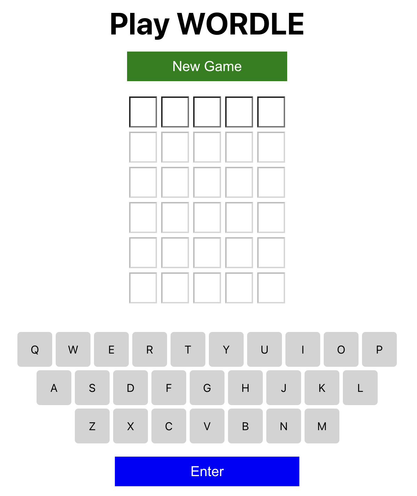
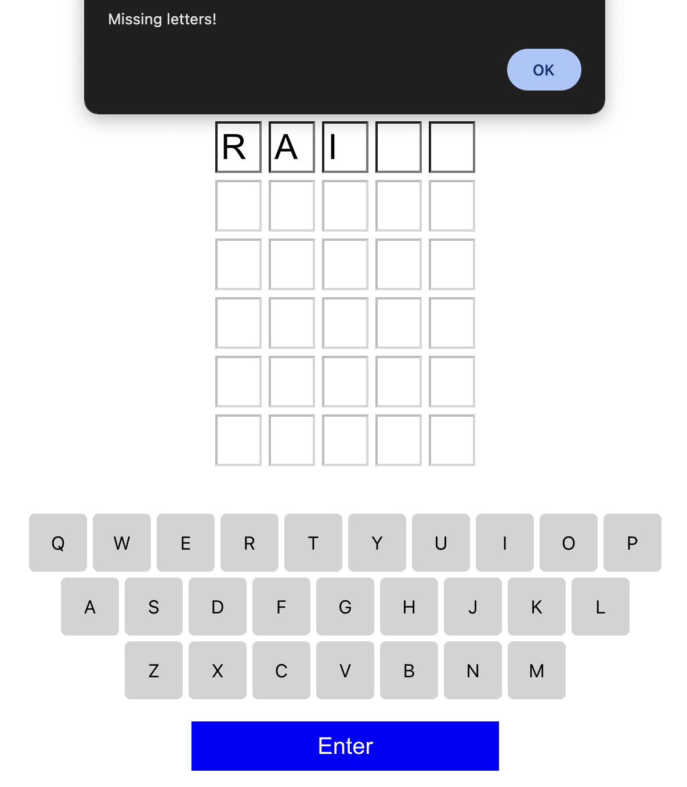
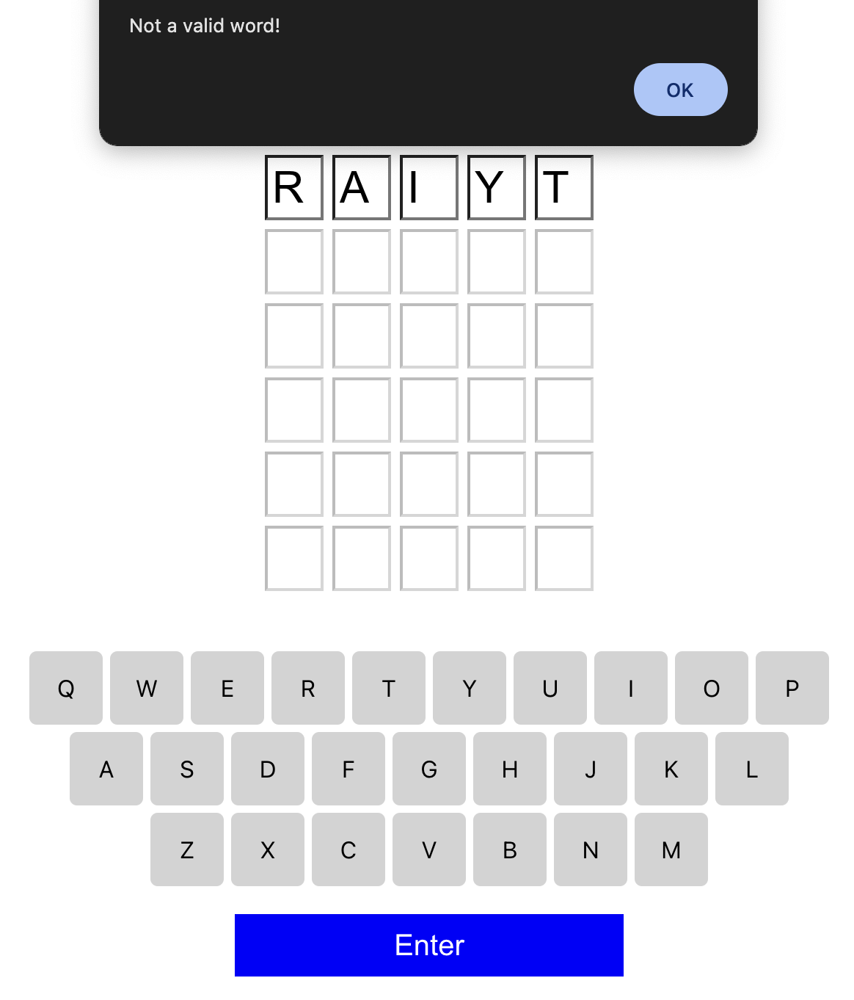
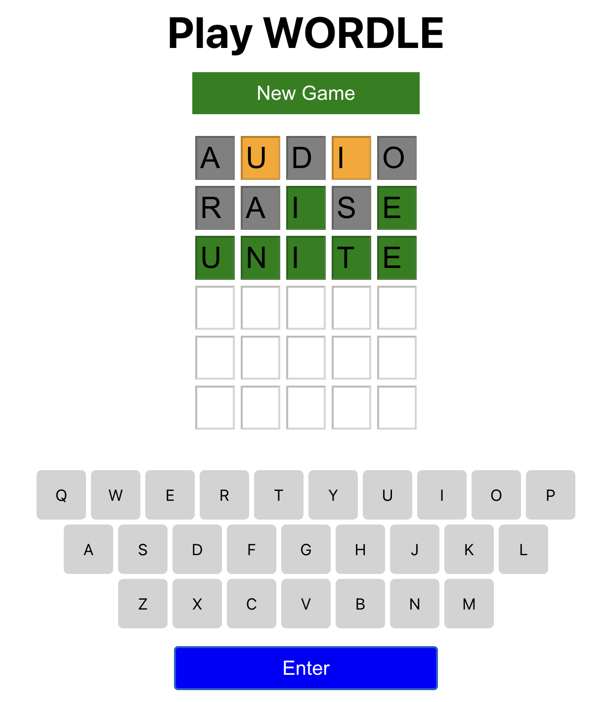

# Wordle-Game-React
Wordle game using React.

### HOW TO RUN:
```console
npm install
npm start
```

### HOW TO PLAY:
1. Every guess must be a real five-letter word.
2. A box's colour will change to indicate how accurate your prediction was.
3. The letter is in the word and in the right place if the tile turns 
4. The letter is in the word, but it is not in the right place, if the tile becomes 
5. The letter is not in the word if the tile becomes 

### SCREENSHOTS:
<kbd></kbd>    <kbd></kbd>
<br/><br/>
<kbd></kbd>    <kbd></kbd>
